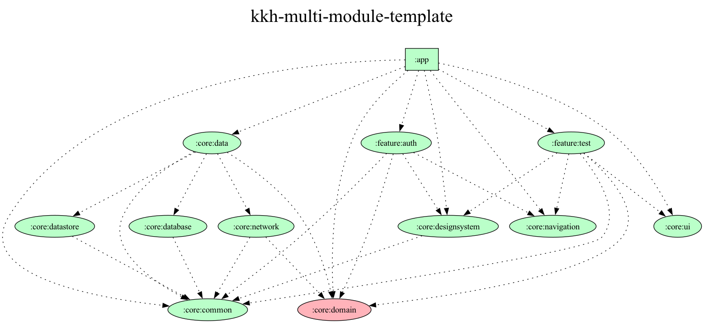

## Tech Stack

### Architecture

- Clean Architecture
- Multi-Module
- MVI

### UI

- Compose
- Coil
- Material3
- Navigation3

### Data

- Retrofit2
- OkHttp3
- KotlinxSerialization
- Datastore
- Room

### DI

- Hilt

### Test

- JUnit5
- Espresso

### Etc

- Custom Plugin (Convention Plugin)
- Coroutines
- KSP

### Dependency Graph

