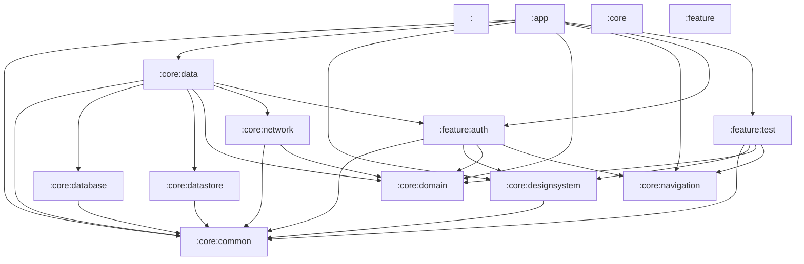

```mermaid
graph TD
    _[":"]
    _app[":app"]
    _app --> _core_common
    _app --> _core_data
    _app --> _core_designsystem
    _app --> _core_domain
    _app --> _core_navigation
    _app --> _feature_auth
    _app --> _feature_test
    _core[":core"]
    _core_common[":core:common"]
    _core_data[":core:data"]
    _core_data --> _core_common
    _core_data --> _core_database
    _core_data --> _core_datastore
    _core_data --> _core_domain
    _core_data --> _core_network
    _core_data --> _feature_auth
    _core_database[":core:database"]
    _core_database --> _core_common
    _core_datastore[":core:datastore"]
    _core_datastore --> _core_common
    _core_designsystem[":core:designsystem"]
    _core_designsystem --> _core_common
    _core_domain[":core:domain"]
    _core_navigation[":core:navigation"]
    _core_network[":core:network"]
    _core_network --> _core_common
    _core_network --> _core_domain
    _feature[":feature"]
    _feature_auth[":feature:auth"]
    _feature_auth --> _core_common
    _feature_auth --> _core_designsystem
    _feature_auth --> _core_domain
    _feature_auth --> _core_navigation
    _feature_test[":feature:test"]
    _feature_test --> _core_common
    _feature_test --> _core_designsystem
    _feature_test --> _core_domain
    _feature_test --> _core_navigation
```