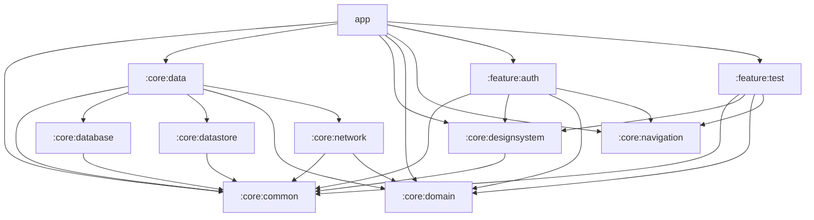

```mermaid
graph TD
    app["app"]
    app --> :core:common
    app --> :core:data
    app --> :core:designsystem
    app --> :core:domain
    app --> :core:navigation
    app --> :feature:auth
    app --> :feature:test
    :core:common[":core:common"]
    :core:data[":core:data"]
    :core:data --> :core:common
    :core:data --> :core:database
    :core:data --> :core:datastore
    :core:data --> :core:domain
    :core:data --> :core:network
    :core:database[":core:database"]
    :core:database --> :core:common
    :core:datastore[":core:datastore"]
    :core:datastore --> :core:common
    :core:designsystem[":core:designsystem"]
    :core:designsystem --> :core:common
    :core:domain[":core:domain"]
    :core:navigation[":core:navigation"]
    :core:network[":core:network"]
    :core:network --> :core:common
    :core:network --> :core:domain
    :feature:auth[":feature:auth"]
    :feature:auth --> :core:common
    :feature:auth --> :core:designsystem
    :feature:auth --> :core:domain
    :feature:auth --> :core:navigation
    :feature:test[":feature:test"]
    :feature:test --> :core:common
    :feature:test --> :core:designsystem
    :feature:test --> :core:domain
    :feature:test --> :core:navigation
```
