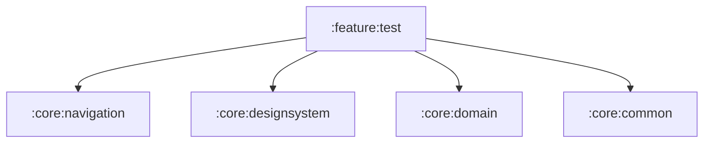

# :feature:test

```mermaid
graph TD
    :feature:test --> :core:navigation
    :feature:test --> :core:designsystem
    :feature:test --> :core:domain
    :feature:test --> :core:common
```

> Note: 위 의존성은 `AndroidFeatureConventionPlugin`을 통해 자동으로 추가됩니다.
